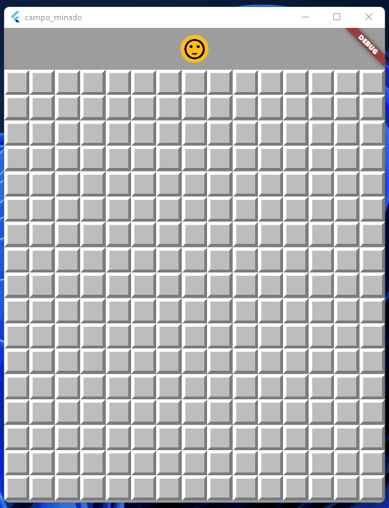

# Mined Field

A Game developed with Flutter framework to train the implementation of features described on Features section.

## Project Status

This project is just a personal showcase, done with de aim of  register what i have studied, and show my skills. It may receives improvements in the future.

## Features in this project

 - [x] Widget composition
 - [x] External image assets to compose the game UI
 - [x] State management setState
 - [x] Unitary tests for field class
 - [x] Unitary tests for result class
 - [x] Unitary tests for board class

## Project features preview

| Playing |
| ------------------------------------------------------ |
|  |

##
## Installation and Setup Instructions

Clone down this repository. You will need `Flutter` and `Dart` installed globally on your machine.

Installation:

`flutter pub get install` on the project root.

To Run the android application:

`flutter run -d <device or emulator id>`

To build a android release:

`flutter build apk` the package will be generated on **./build/app/outputs/flutter-apk/app-release.apk**

## Getting Started

This project is a starting point for a Flutter application.

A few resources to get you started if this is your first Flutter project:

- [Lab: Write your first Flutter app](https://flutter.dev/docs/get-started/codelab)
- [Cookbook: Useful Flutter samples](https://flutter.dev/docs/cookbook)

For help getting started with Flutter, view our
[online documentation](https://flutter.dev/docs), which offers tutorials,
samples, guidance on mobile development, and a full API reference.
